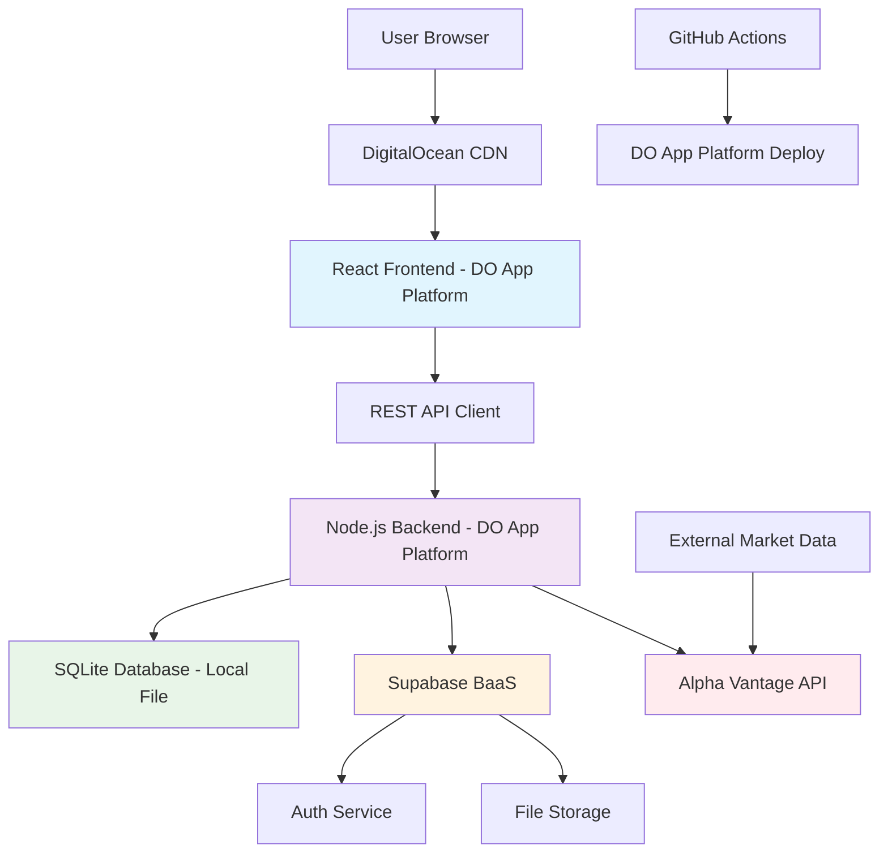
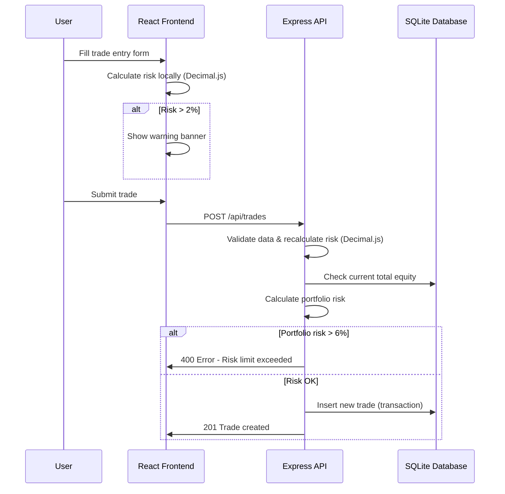
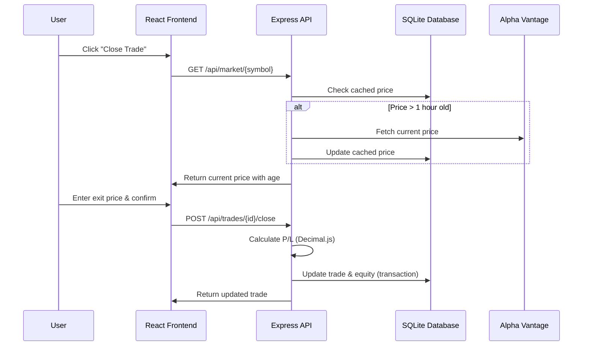

# Trading Log App Fullstack Architecture Document

## Introduction

This document outlines the complete fullstack architecture for Trading Log App, including backend systems, frontend implementation, and their integration. It serves as the single source of truth for AI-driven development, ensuring consistency across the entire technology stack.

This unified approach combines what would traditionally be separate backend and frontend architecture documents, streamlining the development process for modern fullstack applications where these concerns are increasingly intertwined.

### Starter Template Assessment

**Decision:** N/A - Greenfield project built from scratch

**Rationale:** Building from scratch provides complete control over the architecture, performance optimizations, and security requirements specific to trading applications. This approach allows us to optimize for the unique requirements of risk management and financial calculations.

### Change Log
| Date | Version | Description | Author |
|------|---------|-------------|--------|
| August 15, 2025 | 1.0 | Initial fullstack architecture | Winston, Architect |

## High Level Architecture

### Technical Summary

The Trading Log application uses a modern fullstack architecture with React frontend and Node.js backend, deployed on DigitalOcean App Platform. The system starts with SQLite for simplicity and rapid development, with a clear migration path to PostgreSQL as data volume grows. A Backend-as-a-Service (BaaS) solution like Supabase handles authentication, file storage, and additional managed services while the core trading logic remains in the custom backend. The monorepo structure enables shared TypeScript types, ensuring data consistency for financial calculations. This architecture prioritizes simplicity for Phase 1 while maintaining scalability for future growth.

### Platform and Infrastructure Choice

**Platform:** DigitalOcean App Platform + Backend-as-a-Service  
**Key Services:** DigitalOcean App Platform (frontend + backend), SQLite → PostgreSQL migration path, Supabase (auth + storage + managed services)  
**Deployment Host and Regions:** DigitalOcean NYC/SFO regions for low latency

**Phase 1:** SQLite + Supabase (auth/storage)  
**Phase 2:** Migrate to PostgreSQL when approaching SQLite limits (~250GB or high concurrency)

### Repository Structure

**Structure:** Monorepo  
**Monorepo Tool:** npm workspaces  
**Package Organization:** 
- `apps/web` (React frontend)
- `apps/api` (Node.js backend) 
- `packages/shared` (TypeScript types, utilities)
- `packages/database` (SQLite schema, migration scripts)

### High Level Architecture Diagram



### Architectural Patterns

- **Hybrid Architecture:** Custom backend + BaaS services - _Rationale:_ Core trading logic stays in-house while leveraging managed services for common features
- **SQLite → PostgreSQL Migration Pattern:** Start simple, scale when needed - _Rationale:_ Faster MVP development with clear upgrade path
- **Repository Pattern with ORM:** Prisma for database abstraction - _Rationale:_ Easy migration between SQLite and PostgreSQL when the time comes
- **Component-Based UI:** React with TypeScript - _Rationale:_ Maintainable trading interface with type safety
- **API-First Design:** REST endpoints with OpenAPI specification - _Rationale:_ Clear contracts and easy testing

## Tech Stack

### Technology Stack Table

| Category | Technology | Version | Purpose | Rationale |
|----------|------------|---------|---------|-----------|
| Frontend Language | TypeScript | ^5.0.0 | Type-safe frontend development | Prevents runtime errors in financial calculations |
| Frontend Framework | React | ^18.0.0 | UI component framework | Large ecosystem, excellent for data-heavy interfaces |
| Frontend Build Tool | Vite | ^5.0.0 | Fast development and building | Superior dev experience and build performance |
| UI Component Library | Tailwind CSS + Headless UI | ^3.0.0 | Styling and components | Matches UI/UX spec, highly customizable |
| State Management | React Query + Local State | ^5.0.0 | Server and client state | Eliminates complex state management, built-in caching |
| Backend Language | TypeScript | ^5.0.0 | Type-safe backend development | Shared types with frontend, prevents calculation errors |
| Backend Framework | Express.js | ^4.18.0 | Web server framework | Mature, well-documented, extensive middleware |
| API Style | REST | - | API architecture | Simple, cacheable, fits trading data patterns |
| Database (Phase 1) | SQLite | ^3.0.0 | Local development database | Simple setup, file-based, perfect for MVP |
| Database (Phase 2) | PostgreSQL | ^15.0.0 | Production database | ACID compliance, handles financial data reliably |
| ORM | Prisma | ^5.0.0 | Database access layer | Easy SQLite → PostgreSQL migration, type-safe queries |
| Financial Calculations | Decimal.js | ^10.0.0 | Precise decimal arithmetic | Prevents floating-point errors in financial calculations |
| File Storage | Supabase Storage | Latest | File uploads/storage | Managed service, integrated with auth |
| Authentication | Supabase Auth | Latest | User authentication | Managed auth service, social logins |
| Frontend Testing | Vitest + Testing Library | ^1.0.0 | Unit and integration tests | Fast, Vite-native testing |
| Backend Testing | Jest + Supertest | ^29.0.0 | API testing | Mature testing ecosystem |
| E2E Testing | Playwright | ^1.40.0 | End-to-end testing | Reliable, fast, great debugging |
| Build Tool | npm scripts | - | Build orchestration | Simple, no additional complexity |
| Deployment | DigitalOcean App Platform | Latest | Hosting platform | Simple deployment, managed infrastructure |
| CI/CD | GitHub Actions | Latest | Automated deployment | Free for public repos, good DO integration |
| Monitoring | Simple logging + DO monitoring | - | Basic monitoring | Console logs + DO built-in monitoring for MVP |
| Logging | Winston | ^3.0.0 | Structured logging | Standard Node.js logging, works with DO |

## Data Models

### Model 1: User

**Purpose:** Represents a trader using the application, storing their equity and preferences

**Key Attributes:**
- id: string - Unique identifier (UUID)
- email: string - User email (from Supabase Auth)
- totalEquity: number - Current total cash equity in account
- createdAt: Date - Account creation timestamp
- updatedAt: Date - Last modification timestamp

#### TypeScript Interface
```typescript
interface User {
  id: string;
  email: string;
  totalEquity: number;
  createdAt: Date;
  updatedAt: Date;
}
```

#### Relationships
- One-to-many with Trade (user has many trades)
- One-to-many with EquitySnapshot (historical equity tracking)

### Model 2: Trade

**Purpose:** Core entity representing a trading position with all risk management and analysis data

**Key Attributes:**
- id: string - Unique trade identifier
- userId: string - Reference to User
- symbol: string - Trading symbol (e.g., "AAPL", "TSLA")
- direction: 'LONG' | 'SHORT' - Trade direction
- entryPrice: number - Entry price per unit
- positionSize: number - Number of shares/units
- stopLoss: number - Stop loss price
- exitPrice: number | null - Exit price (null if active)
- status: 'ACTIVE' | 'CLOSED' - Trade status
- entryDate: Date - When trade was opened
- exitDate: Date | null - When trade was closed
- realizedPnL: number | null - Actual profit/loss (calculated on close)
- riskAmount: number - Calculated monetary risk
- notes: string | null - General trade notes

#### TypeScript Interface
```typescript
interface Trade {
  id: string;
  userId: string;
  symbol: string;
  direction: 'LONG' | 'SHORT';
  entryPrice: number;
  positionSize: number;
  stopLoss: number;
  exitPrice: number | null;
  status: 'ACTIVE' | 'CLOSED';
  entryDate: Date;
  exitDate: Date | null;
  realizedPnL: number | null;
  riskAmount: number;
  notes: string | null;
  createdAt: Date;
  updatedAt: Date;
}
```

#### Relationships
- Many-to-one with User
- One-to-many with MethodAnalysis (analysis per timeframe)
- One-to-many with MindsetTag (psychological tags)

### Model 3: MethodAnalysis

**Purpose:** Stores technical analysis data for each timeframe used in a trade decision

#### TypeScript Interface
```typescript
interface MethodAnalysis {
  id: string;
  tradeId: string;
  timeframe: 'DAILY' | 'FOUR_HOUR' | 'ONE_HOUR';
  indicator: string;
  signal: string;
  divergence: 'BULLISH' | 'BEARISH' | 'NONE';
  notes: string | null;
  createdAt: Date;
}
```

### Model 4: MindsetTag

**Purpose:** Tracks psychological state when entering trades for performance analysis

#### TypeScript Interface
```typescript
interface MindsetTag {
  id: string;
  tradeId: string;
  tag: string;
  createdAt: Date;
}
```

### Model 5: EquitySnapshot

**Purpose:** Historical tracking of total equity for equity curve generation

#### TypeScript Interface
```typescript
interface EquitySnapshot {
  id: string;
  userId: string;
  totalEquity: number;
  timestamp: Date;
  source: 'TRADE_CLOSE' | 'MANUAL_UPDATE' | 'DAILY_SNAPSHOT';
}
```

### Model 6: MarketData

**Purpose:** Cached market data for live equity curve calculations

#### TypeScript Interface
```typescript
interface MarketData {
  id: string;
  symbol: string;
  currentPrice: number;
  lastUpdated: Date;
  source: string;
}
```

## API Specification

### REST API Specification

```yaml
openapi: 3.0.0
info:
  title: Trading Log API
  version: 1.0.0
  description: REST API for Trading Log application providing risk management and trade analysis
servers:
  - url: https://api-trading-log.ondigitalocean.app
    description: Production API (DigitalOcean)
  - url: http://localhost:3001
    description: Local development server

paths:
  # User & Equity Management
  /api/user:
    get:
      summary: Get current user profile
      tags: [User]
      security:
        - BearerAuth: []
      responses:
        200:
          description: User profile data
    
    patch:
      summary: Update user equity
      tags: [User]
      security:
        - BearerAuth: []
      requestBody:
        required: true
        content:
          application/json:
            schema:
              type: object
              properties:
                totalEquity:
                  type: number

  # Trade Management
  /api/trades:
    get:
      summary: Get user's trades with filtering
      tags: [Trades]
      security:
        - BearerAuth: []
      parameters:
        - name: status
          in: query
          schema:
            type: string
            enum: [ACTIVE, CLOSED, ALL]
      responses:
        200:
          description: List of trades
    
    post:
      summary: Create new trade with risk validation
      tags: [Trades]
      security:
        - BearerAuth: []
      responses:
        201:
          description: Trade created successfully
        400:
          description: Risk validation failed

  /api/trades/{tradeId}/close:
    post:
      summary: Close an active trade
      tags: [Trades]
      security:
        - BearerAuth: []
      requestBody:
        required: true
        content:
          application/json:
            schema:
              type: object
              properties:
                exitPrice:
                  type: number
      responses:
        200:
          description: Trade closed successfully

  # Market Data - Simplified refresh on demand
  /api/market/refresh:
    post:
      summary: Refresh market data for active positions
      description: Manually refresh prices, respects Alpha Vantage rate limits
      tags: [Market]
      security:
        - BearerAuth: []
      responses:
        200:
          description: Market data refreshed
        429:
          description: Rate limit exceeded

  /api/market/{symbol}:
    get:
      summary: Get cached market price
      description: Returns cached price with age information
      tags: [Market]
      security:
        - BearerAuth: []
      responses:
        200:
          description: Cached market data

components:
  securitySchemes:
    BearerAuth:
      type: http
      scheme: bearer
      description: Supabase JWT token
```

### Alpha Vantage Integration

**External API:** Alpha Vantage
- **Purpose:** Real-time stock market data
- **Documentation:** https://www.alphavantage.co/documentation/
- **Base URL:** https://www.alphavantage.co/query
- **Authentication:** API Key (free tier: 5 calls/minute, 500 calls/day)
- **Rate Limits:** 5 calls/minute, 500 calls/day (free tier)

**Key Endpoints Used:**
- `GET /query?function=GLOBAL_QUOTE&symbol={symbol}&apikey={key}` - Real-time price quotes

**Critical Actions That Trigger Refresh:**
1. Opening new trade - Need current price for risk calculation
2. Closing trade - Need current price for P/L calculation  
3. Loading dashboard - User explicitly wants current view
4. Manual refresh button - User clicks refresh

**Cost Control Strategy:**
- Cache market data for 1 hour minimum
- Show price age clearly in UI
- Simple daily quota counter in database
- Clear error messages when quota exceeded

## Components (Simplified)

### Component 1: React Frontend App

**Responsibility:** Complete user interface for trading journal and risk management

**Key Interfaces:**
- Dashboard page with equity curve and risk widgets
- Trade entry/edit forms with real-time calculations  
- Trade journal and analysis screens

**Dependencies:** Express API, Supabase Auth

**Technology Stack:** React, TypeScript, Tailwind CSS, React Query, Chart.js

### Component 2: Express API Server

**Responsibility:** All business logic, data validation, and external integrations

**Key Interfaces:**
- REST endpoints for trades, users, market data, analytics
- Risk calculations using Decimal.js for precision
- Market data fetching and basic caching
- Performance statistics via SQL aggregation

**Dependencies:** SQLite database, Alpha Vantage API, Supabase Auth validation

**Technology Stack:** Express.js, TypeScript, Prisma ORM, Decimal.js

### Component 3: SQLite Database

**Responsibility:** Data persistence for all application data

**Technology Stack:** SQLite database, Prisma ORM for type-safe access

### Component 4: Supabase Auth Integration

**Responsibility:** User authentication and session management

**Technology Stack:** Supabase client libraries

## Core Workflows

### Workflow 1: Create New Trade with Risk Validation



### Workflow 2: Close Trade with Market Data Refresh



## Frontend Architecture (Simplified)

### Component Organization
```
apps/web/src/
├── components/          # All UI components
│   ├── Dashboard.tsx
│   ├── TradeForm.tsx
│   ├── TradeList.tsx
│   ├── RiskWidget.tsx
│   └── ui/             # Basic components
├── pages/              # Page-level components
│   ├── DashboardPage.tsx
│   ├── JournalPage.tsx
│   └── AnalysisPage.tsx
├── lib/                # Utilities and configuration
│   ├── api.ts          # All API calls
│   ├── auth.ts         # Supabase client
│   ├── utils.ts        # Calculations, formatters
│   └── types.ts        # TypeScript types
└── App.tsx
```

### State Management - React Query + Local State
```typescript
// lib/api.ts - Simple API functions
export const getTrades = async (): Promise<Trade[]> => {
  const response = await api.get('/api/trades');
  return response.data;
};

export const createTrade = async (data: CreateTradeRequest): Promise<Trade> => {
  const response = await api.post('/api/trades', data);
  return response.data;
};

// Component usage
const { data: trades = [], isLoading } = useQuery({
  queryKey: ['trades'],
  queryFn: getTrades,
});
```

### Financial Calculations with Decimal.js
```typescript
// lib/utils.ts - Precise financial calculations
import Decimal from 'decimal.js';

export const calculateTradeRisk = (entryPrice: number, stopLoss: number, size: number): number => {
  return new Decimal(entryPrice)
    .minus(stopLoss)
    .abs()
    .times(size)
    .toNumber();
};

export const calculatePortfolioRisk = (trades: Trade[]): number => {
  return trades
    .filter(trade => trade.status === 'ACTIVE')
    .reduce((total, trade) => new Decimal(total).plus(trade.riskAmount).toNumber(), 0);
};
```

## Backend Architecture

### Express Route Organization
```
apps/api/src/
├── routes/              # Route handlers
│   ├── trades.ts
│   ├── users.ts
│   ├── market.ts
│   └── analysis.ts
├── models/              # Prisma client
│   └── index.ts
├── middleware/          # Auth, validation, errors
│   ├── auth.ts
│   ├── validation.ts
│   └── errors.ts
├── utils/               # Business logic
│   ├── calculations.ts  # Decimal.js calculations
│   └── market-data.ts   # Alpha Vantage integration
└── app.ts
```

### Database Schema (Prisma)
```prisma
model User {
  id          String   @id @default(cuid())
  email       String   @unique
  totalEquity Float
  createdAt   DateTime @default(now())
  updatedAt   DateTime @updatedAt
  
  trades          Trade[]
  equitySnapshots EquitySnapshot[]
}

model Trade {
  id           String      @id @default(cuid())
  userId       String
  symbol       String
  direction    TradeDirection
  entryPrice   Float
  positionSize Float
  stopLoss     Float
  exitPrice    Float?
  status       TradeStatus
  riskAmount   Float
  realizedPnL  Float?
  createdAt    DateTime    @default(now())
  
  user           User              @relation(fields: [userId], references: [id])
  methodAnalysis MethodAnalysis[]
  mindsetTags    MindsetTag[]
}
```

### Critical Safety Measures
```typescript
// Database transactions for financial operations
await prisma.$transaction(async (tx) => {
  const user = await tx.user.findUnique({ where: { id: userId } });
  // Validate risk with locked data
  const trade = await tx.trade.create({ data: tradeData });
  return trade;
});

// Request deduplication
const [isSubmitting, setIsSubmitting] = useState(false);
const handleSubmit = async (data) => {
  if (isSubmitting) return;
  setIsSubmitting(true);
  try {
    await createTrade(data);
  } finally {
    setIsSubmitting(false);
  }
};
```

## Deployment Architecture

### Deployment Strategy

**Frontend Deployment:**
- **Platform:** DigitalOcean App Platform (Static Site)
- **Build Command:** `npm run build`
- **Output Directory:** `apps/web/dist`

**Backend Deployment:**
- **Platform:** DigitalOcean App Platform (Node.js service)
- **Build Command:** `npm run build`
- **Deployment Method:** Container deployment

### Environments

| Environment | Frontend URL | Backend URL | Purpose |
|-------------|--------------|-------------|---------|
| Development | http://localhost:5173 | http://localhost:3001 | Local development |
| Production | https://trading-log.ondigitalocean.app | https://api-trading-log.ondigitalocean.app | Live environment |

### CI/CD Pipeline
```yaml
name: Deploy to DigitalOcean
on:
  push:
    branches: [main]
jobs:
  deploy:
    runs-on: ubuntu-latest
    steps:
      - uses: actions/checkout@v4
      - name: Setup Node.js
        uses: actions/setup-node@v4
        with:
          node-version: '18'
      - run: npm ci
      - run: npm run test
      - run: npm run build
      - name: Deploy to DigitalOcean
        uses: digitalocean/app_action@v1
        with:
          app_name: trading-log
          token: ${{ secrets.DIGITALOCEAN_ACCESS_TOKEN }}
```

## Security and Performance

### Security Requirements

**Frontend Security:**
- Input sanitization and React's built-in XSS protection
- Supabase session tokens in secure storage

**Backend Security:**
- Zod schemas for all API inputs
- Rate limiting: 100 requests per minute per IP
- CORS policy for specific origins only

**Authentication:**
- Supabase JWT tokens with automatic refresh
- Database transactions for financial operations

### Performance Optimization

**Frontend Performance:**
- Bundle size target: <500KB initial load
- React Query for automatic caching and background updates
- Code splitting by route

**Backend Performance:**
- Response time target: <200ms for API endpoints
- Database indexes on frequently queried columns
- Market data caching (1 hour TTL)

## Testing Strategy

### Testing Pyramid
```
          E2E Tests (Playwright)
         /                    \
    Integration Tests (API)     
       /                    \
  Frontend Unit (Vitest)  Backend Unit (Jest)
```

### Critical Test Scenarios

**Financial Calculation Tests:**
```typescript
// Test decimal precision
test('risk calculation precision', () => {
  const risk = calculateTradeRisk(100.1, 99.9, 1000);
  expect(risk).toBe(200); // Exact decimal result
});

// Test edge cases
test('portfolio risk with multiple trades', () => {
  const trades = [
    { riskAmount: 100.33 },
    { riskAmount: 250.67 }
  ];
  expect(calculatePortfolioRisk(trades)).toBe(351);
});
```

**Concurrency Tests:**
```typescript
// Test race conditions
test('concurrent trade creation', async () => {
  const promises = Array(5).fill(null).map(() => createTrade(validTradeData));
  const results = await Promise.allSettled(promises);
  const successful = results.filter(r => r.status === 'fulfilled');
  expect(successful).toHaveLength(1); // Only one should succeed
});
```

## Development Workflow

### Local Setup
```bash
# Install dependencies
npm install

# Setup environment
cp .env.example .env.local

# Setup database
npx prisma migrate dev

# Start development
npm run dev
```

### Required Environment Variables
```bash
# Frontend
VITE_API_URL=http://localhost:3001
VITE_SUPABASE_URL=your_supabase_url
VITE_SUPABASE_ANON_KEY=your_supabase_key

# Backend
DATABASE_URL="file:./dev.db"
SUPABASE_URL=your_supabase_url
SUPABASE_ANON_KEY=your_supabase_key
ALPHA_VANTAGE_API_KEY=your_alpha_vantage_key
```

## Project Structure

```
trading-log/
├── .github/workflows/          # CI/CD
├── apps/
│   ├── web/                    # React frontend
│   │   ├── src/
│   │   │   ├── components/
│   │   │   ├── pages/
│   │   │   ├── lib/
│   │   │   └── App.tsx
│   │   └── package.json
│   └── api/                    # Express backend
│       ├── src/
│       │   ├── routes/
│       │   ├── models/
│       │   ├── middleware/
│       │   └── app.ts
│       └── package.json
├── packages/
│   └── shared/                 # Shared types
│       └── src/types/
├── tests/e2e/                  # Playwright tests
├── docs/                       # Documentation
└── package.json                # Root monorepo
```

## Critical Implementation Requirements

### Before Development Starts

**🚨 Financial Safety (CRITICAL):**
- Implement Decimal.js for all monetary calculations
- Add database transactions for trade operations  
- Add request deduplication to prevent double submissions

**🚨 Data Integrity (CRITICAL):**
- Add proper error boundaries in React
- Implement retry logic for API failures
- Add health check endpoints

**🚨 Security Basics (REQUIRED):**
- Input sanitization beyond Zod validation
- Rate limiting on trade creation endpoints
- Audit trail for equity changes

**Migration Triggers for PostgreSQL:**
- Database file size approaching 200GB
- Need for concurrent user access
- Complex analytical queries becoming slow

This architecture provides a solid foundation for rapid MVP development while maintaining the flexibility to scale as the application grows.