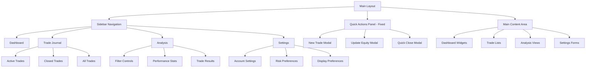
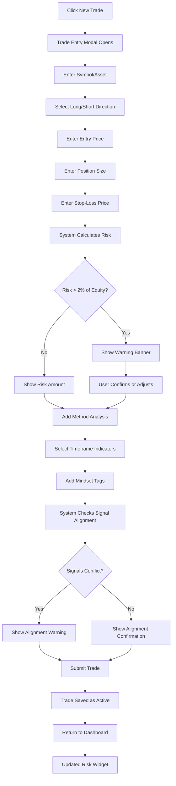
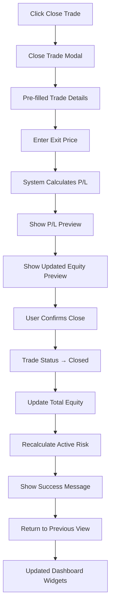
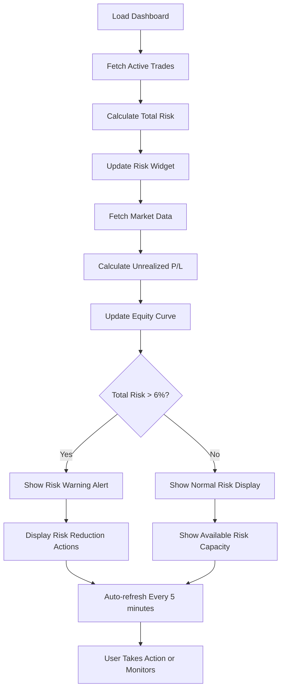

# Trading Log App UI/UX Specification

## Introduction

This document defines the user experience goals, information architecture, user flows, and visual design specifications for Trading Log App's user interface. It serves as the foundation for visual design and frontend development, ensuring a cohesive and user-centered experience.

### Overall UX Goals & Principles

#### Target User Personas
- **Serious Retail Trader:** Disciplined traders seeking active risk management support and performance analysis tools. They need real-time feedback, structured logging capabilities, and clear visual indicators to maintain trading discipline.

#### Usability Goals
- **Rapid Entry:** Traders can log new trades in under 30 seconds during market hours
- **Instant Risk Feedback:** Risk warnings appear immediately when 2% or 6% thresholds are approached
- **Effortless Analysis:** Historical performance data can be filtered and analyzed within 3 clicks
- **Mobile Accessibility:** All core functions work seamlessly on mobile devices during trading

#### Design Principles
1. **Clarity over cleverness** - Trading decisions require clear information, not decorative elements
2. **Immediate visual feedback** - Risk status and trade alignment must be instantly recognizable
3. **Efficient data entry** - Minimize cognitive load during high-stress trading moments
4. **Progressive disclosure** - Show essential information first, detailed analysis on demand
5. **Consistent risk awareness** - Risk management visuals follow the same patterns throughout

### Change Log
| Date | Version | Description | Author |
|------|---------|-------------|--------|
| August 15, 2025 | 1.0 | Initial UI/UX specification | Sally, UX Expert |

## Information Architecture (IA)

### Site Map / Screen Inventory

### Navigation Structure

**Primary Navigation:**
- Sidebar navigation (always visible on desktop, collapsible on mobile)
- Dashboard, Trade Journal, Analysis, Settings
- Quick Actions panel fixed/floating for constant access

**Secondary Navigation:**
- Dashboard: Quick Actions panel (always visible)
- Trade Journal: Sidebar submenu (Active Trades, Closed Trades, All Trades)
- Analysis: Sidebar filter panels with collapsible sections
- Settings: Sidebar submenu (Account, Risk Preferences, Display)

**Quick Actions Panel (Always Visible):**
- New Trade (primary CTA)
- Update Equity
- Quick Close Trade (if active trades exist)

**Breadcrumb Strategy:**
Enhanced breadcrumbs for sidebar navigation:
- Shows current section and subsection
- Trade Journal > Active Trades > [Trade Symbol]
- Analysis > Filtered View > [Applied Filters]

## User Flows

### Flow 1: Log a New Trade

**User Goal:** Quickly enter a new trade position with risk validation before committing

**Entry Points:** 
- Quick Actions panel "New Trade" button
- Dashboard CTA when no active trades exist

**Success Criteria:** Trade logged with all required data, risk calculated and validated, trader aware of alignment/conflicts

**Flow Diagram:**

**Edge Cases & Error Handling:**
- Invalid symbol entered → Show error with suggestion list
- Stop-loss in wrong direction → Validation error with explanation
- Network failure during save → Local storage with retry mechanism
- Market closed warning → Continue with delayed execution note
- Exceeding 6% total risk → Block submission with portfolio risk warning

### Flow 2: Close an Active Trade

**User Goal:** Exit a position, calculate P/L, and update equity with minimal friction

**Entry Points:**
- Trade Journal "Close" button on active trade
- Quick Actions "Quick Close" (if only one active trade)
- Trade detail view "Close Position" button

**Success Criteria:** Trade closed with accurate P/L calculation, equity updated, trade moved to closed status

**Flow Diagram:**

**Edge Cases & Error Handling:**
- Invalid exit price → Validation with market price reference
- Network failure → Queue for retry with user notification
- Simultaneous close attempts → Lock mechanism with user feedback
- Exit price seems unrealistic → Confirmation dialog

### Flow 3: Risk Management Dashboard Monitoring

**User Goal:** Continuously monitor total portfolio risk and individual position status

**Entry Points:**
- Default dashboard landing
- Navigation sidebar "Dashboard"
- Quick risk check during trading session

**Success Criteria:** Real-time risk awareness with clear visual indicators and actionable insights

**Flow Diagram:**

**Edge Cases & Error Handling:**
- Market data API failure → Show last known prices with 5-minute timestamp
- Stale data warning → Visual indicator if data >10 minutes old
- Risk exceeds 6% → Prominent warning with suggested position adjustments
- Connection issues → Manual refresh button available, cached data with age indicator

## Wireframes & Mockups

### Design Files Strategy

**Primary Design Files:** To be created in Figma (recommended for responsive web app design)
- Component library and design system
- High-fidelity mockups for all core screens
- Interactive prototypes for critical user flows
- Mobile responsive variants

### Key Screen Layouts

#### Screen 1: Main Dashboard

**Purpose:** Central command center providing at-a-glance risk status and equity performance

**Key Elements:**
- Live Equity Curve chart (primary visual focus, top-center)
- Total Active Risk widget (prominent position, color-coded)
- Current Equity display (large, clear typography)
- Quick Actions panel (fixed sidebar or floating)
- Active trades summary (condensed list view)
- Last update timestamp (5-minute refresh indicator)

**Interaction Notes:** 
- Risk widget changes color only when >6% threshold exceeded
- Chart responsive to screen size, maintains readability on mobile
- Quick actions always accessible without scrolling

**Design File Reference:** [Dashboard - Main View] (Figma frame to be created)

#### Screen 2: New Trade Entry Modal

**Purpose:** Streamlined trade logging with immediate risk feedback

**Key Elements:**
- Symbol/Asset input (autocomplete/dropdown)
- Long/Short toggle (prominent visual distinction)
- Entry price, position size, stop-loss fields (logical tab order)
- Risk calculation display (updates in real-time)
- Risk warning banner (appears only when >2% risk)
- Method analysis collapsible section (3 timeframes)
- Mindset tags (multi-select chips)
- Signal alignment feedback (visual indicators)

**Interaction Notes:**
- Modal overlay maintains dashboard context
- Form validation prevents invalid submissions
- Risk calculation visible before commitment
- Progressive disclosure: core fields → analysis → psychological

**Design File Reference:** [Modal - New Trade Entry] (Figma frame to be created)

#### Screen 3: Trade Journal List

**Purpose:** Comprehensive view of all trades with filtering and status management

**Key Elements:**
- Sidebar filters (Active/Closed/All tabs)
- Trade list with key data (symbol, entry, risk, P/L, status)
- Action buttons per trade (Close, Adjust Stop, View Details)
- Sort controls (date, P/L, risk)
- Search functionality
- Trade status indicators (color coding)
- Pagination or infinite scroll

**Interaction Notes:**
- Quick actions available without leaving list view
- Visual distinction between active and closed trades
- Mobile: collapsible filters, swipe actions on trades

**Design File Reference:** [Trade Journal - List View] (Figma frame to be created)

#### Screen 4: Analysis Screen

**Purpose:** Performance analytics with flexible filtering and statistics

**Key Elements:**
- Filter sidebar (Indicator, Signal, Mindset, Outcome, Grade)
- Applied filters display (removable chips)
- Performance statistics panel (Win/Loss ratio, avg profit/loss)
- Filtered trade results table
- Trade grading visualization
- Export functionality
- Clear filters action

**Interaction Notes:**
- Real-time statistics updates as filters change
- Visual feedback for applied filters
- Mobile: collapsible filter panel, horizontal scroll for table

**Design File Reference:** [Analysis - Filtered View] (Figma frame to be created)

## Component Library / Design System

### Design System Approach

**Design System Approach:** Simple, reusable component library focused on speed and consistency. Build core components that can be easily combined and reused across all screens.

### Core Components

#### Component 1: Status Badge

**Purpose:** Display any status with color coding

**Variants:** Success (green), Warning (red), Neutral (gray), Info (blue)

**States:** Default, Small, Large

**Usage Guidelines:** Use for trade status, risk warnings, signal alignment, any binary status indicators

#### Component 2: Data Card

**Purpose:** Container for displaying grouped information

**Variants:** Default, Compact, Full-width

**States:** Default, Loading, Error

**Usage Guidelines:** Risk widgets, equity displays, trade summaries, statistics panels

#### Component 3: Input Field

**Purpose:** Standard form input with validation

**Variants:** Text, Number, Select, TextArea

**States:** Default, Focus, Error, Disabled

**Usage Guidelines:** All form inputs across trade entry, settings, filters

#### Component 4: Button

**Purpose:** Standard action trigger

**Variants:** Primary, Secondary, Danger, Ghost

**States:** Default, Hover, Loading, Disabled

**Usage Guidelines:** Trade actions, form submissions, navigation

#### Component 5: List Item

**Purpose:** Repeatable item in lists

**Variants:** Default, Compact, With-actions

**States:** Default, Selected, Hover

**Usage Guidelines:** Trade lists, filter options, navigation items

#### Component 6: Modal

**Purpose:** Overlay for focused tasks

**Variants:** Small, Medium, Large

**States:** Open, Closed

**Usage Guidelines:** Trade entry, confirmations, detailed views

## Branding & Style Guide

### Visual Identity

**Brand Guidelines:** Clean, professional trading tool aesthetic. No specific branding defined - focus on readability and functionality over visual flair.

### Color Palette

| Color Type | Hex Code | Usage |
|------------|----------|--------|
| Primary | #2563eb | Navigation, primary buttons, links |
| Secondary | #64748b | Secondary text, borders |
| Accent | #3b82f6 | Hover states, active elements |
| Success | #10b981 | Positive P/L, safe risk status, confirmation |
| Warning | #ef4444 | Risk warnings, losses, errors |
| Error | #dc2626 | Form errors, failed actions |
| Neutral | #f8fafc, #e2e8f0, #475569 | Backgrounds, text, borders |

### Typography

#### Font Families
- **Primary:** Inter (clean, readable sans-serif)
- **Secondary:** System font stack fallback
- **Monospace:** Monaco, 'Courier New' (for numbers/data)

#### Type Scale

| Element | Size | Weight | Line Height |
|---------|------|--------|-------------|
| H1 | 32px | 700 | 1.2 |
| H2 | 24px | 600 | 1.3 |
| H3 | 20px | 600 | 1.4 |
| Body | 16px | 400 | 1.5 |
| Small | 14px | 400 | 1.4 |

### Iconography

**Icon Library:** Lucide React (consistent, minimal icons)

**Usage Guidelines:** 16px and 24px sizes, consistent stroke width, used sparingly for clarity

### Spacing & Layout

**Grid System:** CSS Grid and Flexbox

**Spacing Scale:** 4px base unit (4, 8, 12, 16, 24, 32, 48, 64px)

## Accessibility Requirements

### Compliance Target

**Standard:** WCAG AA compliance as specified in PRD

### Key Requirements

**Visual:**
- Color contrast ratios: 4.5:1 for normal text, 3:1 for large text
- Focus indicators: Clear 2px outline on interactive elements
- Text sizing: Readable at 200% zoom without horizontal scroll

**Interaction:**
- Keyboard navigation: Full functionality without mouse
- Screen reader support: Proper ARIA labels and structure
- Touch targets: Minimum 44px for mobile interactions

**Content:**
- Alternative text: Descriptive text for charts and visual indicators
- Heading structure: Logical H1-H6 hierarchy for navigation
- Form labels: Clear labels associated with all inputs

### Testing Strategy

Manual testing with screen readers and keyboard navigation, automated testing with axe-core, user testing with accessibility tools enabled.

## Responsiveness Strategy

### Breakpoints

| Breakpoint | Min Width | Max Width | Target Devices |
|------------|-----------|-----------|----------------|
| Mobile | 320px | 767px | Phones |
| Tablet | 768px | 1023px | Tablets, small laptops |
| Desktop | 1024px | 1439px | Laptops, desktops |
| Wide | 1440px | - | Large monitors |

### Adaptation Patterns

**Layout Changes:** Sidebar collapses to hamburger menu on mobile, quick actions become bottom floating panel, dashboard widgets stack vertically

**Navigation Changes:** Sidebar becomes slide-out drawer, breadcrumbs simplified, touch-friendly tap targets

**Content Priority:** Risk status always visible, chart maintains prominence, secondary data hidden behind expandable sections

**Interaction Changes:** Modals become full-screen on mobile, swipe gestures for trade actions, larger touch targets for buttons

## Animation & Micro-interactions

### Motion Principles

Smooth, polished transitions that create a professional feel without distraction. Every UI change should feel fluid and intentional, enhancing the sense of a high-quality trading tool.

### Key Animations

- **Risk Warning Appear:** Smooth fade-in with gentle slide-up (250ms, ease-out)
- **Modal Open/Close:** Smooth scale with backdrop fade (200ms, ease-in-out) 
- **Sidebar Toggle:** Fluid slide transition with easing (250ms, cubic-bezier(0.4, 0, 0.2, 1))
- **Data Updates:** Smooth number counting transitions (400ms, ease-out)
- **Page Transitions:** Subtle fade between sections (150ms, ease-in-out)
- **Button States:** Smooth color and shadow transitions (150ms, ease-out)
- **Form Field Focus:** Smooth border and shadow transitions (200ms, ease-out)
- **List Item Interactions:** Smooth hover and selection states (100ms, ease-out)
- **Chart Updates:** Smooth line/bar transitions for equity curve (300ms, ease-in-out)

## Performance Considerations

### Performance Goals

- **Page Load:** <2 seconds initial load
- **Interaction Response:** <100ms for all user actions
- **Animation FPS:** 60fps for all transitions

### Design Strategies

Minimize large images, optimize chart rendering, lazy load non-critical components, efficient component re-rendering patterns, 5-minute data refresh cycle to balance real-time needs with performance.

## Next Steps

### Immediate Actions

1. Create Figma workspace and component library
2. Design high-fidelity mockups for all core screens  
3. Build interactive prototypes for key user flows
4. Validate responsive breakpoints with stakeholders
5. Review final specification with development team

### Design Handoff Checklist

- [x] All user flows documented
- [x] Component inventory complete  
- [x] Accessibility requirements defined
- [x] Responsive strategy clear
- [x] Brand guidelines incorporated
- [x] Performance goals established